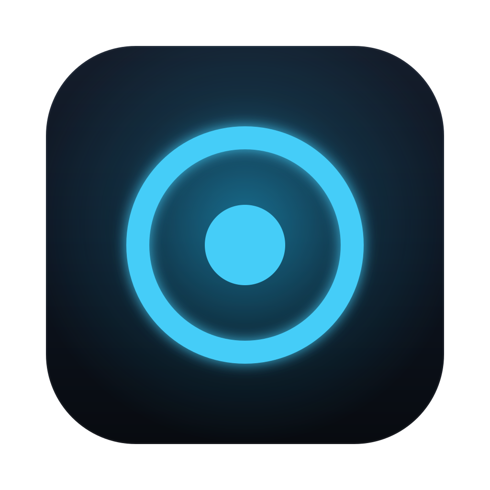

# GLanSync

**Screen &amp; music sync for your Govee lights. Local over your LAN, no cloud.**

This repository hosts the **downloads** for GLanSync. The application source is private.

## Download

| Platform | Download | Requirements | Notes |
| --- | --- | --- | --- |
| **macOS** | [GLanSync-mac-arm64.dmg](https://github.com/mertcanmerkit/glansync-releases/releases/latest/download/GLanSync-mac-arm64.dmg) · [zip](https://github.com/mertcanmerkit/glansync-releases/releases/latest/download/GLanSync-mac-arm64.zip) | macOS 13+, Apple Silicon | Signed, not yet notarized — see below |
| **Windows** | [GLanSync-Setup-x64.exe](https://github.com/mertcanmerkit/glansync-releases/releases/latest/download/GLanSync-Setup-x64.exe) | Windows 10/11, x64 | **Beta** |
| **Windows on ARM** | [GLanSync-Setup-arm64.exe](https://github.com/mertcanmerkit/glansync-releases/releases/latest/download/GLanSync-Setup-arm64.exe) | Snapdragon / ARM64 PCs | **Beta** |

SHA-256 checksums and older versions live on the [Releases page](https://github.com/mertcanmerkit/glansync-releases/releases).

## Install — macOS

1. Open the `.dmg` and drag **GLanSync** into **Applications**.
2. Double-click it once. macOS says it *"cannot be opened because the developer cannot be verified"* — close that dialog.
3. Open **System Settings → Privacy & Security**, scroll to *"GLanSync was blocked…"*, click **Open Anyway**, and confirm.

That check happens once. (The app is code-signed, but Apple notarization is not set up yet — that is the entire reason for the extra step. Terminal alternative: `xattr -d com.apple.quarantine /Applications/GLanSync.app`.)

On first use macOS asks for:

- **Screen Recording** — required by Screen Sync to sample your display's colors.
- **Local Network** — required to find and control your lights.
- **Microphone** — only if you use microphone-driven music sync.

## Install — Windows (beta)

1. Run `GLanSync-Setup-x64.exe`. Edge/Chrome may warn about the download: choose **Keep → Keep anyway**.
2. SmartScreen shows *"Windows protected your PC"* — click **More info → Run anyway**. The installer is not signed yet.
3. On the first LAN scan, Windows asks for firewall access: allow GLanSync on **Private networks**.

On Snapdragon / ARM64 machines, use the **arm64** installer instead.

## What it does

- **Screen sync** — mirrors your display's colors to your lights in real time, with per-device screen areas and 4–255 sampling zones.
- **Music sync** — system audio or microphone drives the lights: palettes, motion patterns, spectrum presets, stereo panning. System audio uses native WASAPI loopback on Windows.
- **Scenes and groups** — scenes play mirrored or flow device-to-device; each group stores its own full configuration.
- **Menu bar / tray controls** and `glansync://` deep links (Siri Shortcuts on macOS, Automation URLs on Windows).

Control is 100% local: the app talks to your lights over your own network. No account, no cloud, no telemetry.

## Device compatibility

| Tier | What you get | Devices |
| --- | --- | --- |
| Hardware-verified realtime | Screen + music sync, scenes, areas | Gaming Light Strip G1 (H6609) |
| Community-verified realtime | Screen + music sync, scenes, areas | ~31 models — Glide Hexa / Y / Tri panels, RGBIC gaming &amp; TV light bars, H619x strips, neon ropes, floor lamps… |
| Basic LAN control | Power, brightness, static color | Any Govee device exposing "LAN Control" in Govee Home |

Enable **LAN Control** for each device in the Govee Home app first. The 7-day trial is there to prove compatibility on your own hardware before you pay.

## Privacy

No telemetry. The app fetches a small licensing configuration file over HTTPS at launch and every ~6 hours (a plain GET — no identifiers, no cookies), and contacts Lemon Squeezy only when a license key is in use. Full policy: <https://glansync.com/privacy/>.

## Support

[support@glansync.com](mailto:support@glansync.com) · <https://glansync.com>

---

GLanSync is an unofficial, third-party application for controlling Govee-brand smart lights. It is not affiliated with, endorsed by, or officially connected to Govee or Shenzhen Intellirocks Tech Co., Ltd. Govee® and related product names are trademarks of their respective owners. The official Govee apps are at <a href="https://www.govee.com">govee.com</a>.
